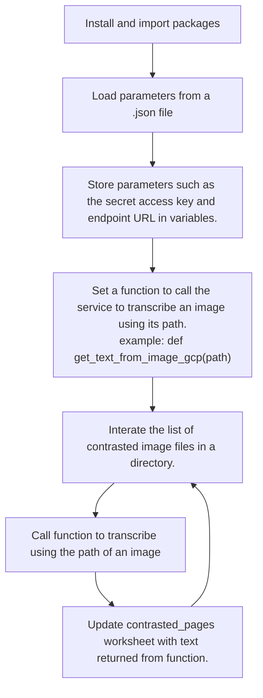

# fieldbooks_antioch

This program transcribes images of a handwritten fieldbook into text. It does it with three different services:

+ Microsoft Azure Cognititive Services
+ Amazon Web Services
+ Google Cloud Platform.

The results are stored in a [Google sheet](https://docs.google.com/spreadsheets/d/1RJIX6HDAOfD1GObbu1wJOo-gOlRG3uWwG0JM_iQWdA8/edit?usp=sharing). See the 'contrasted_pages' sheet.

## Objectives

### Primary

Transcribe the writing in the fieldbook with high quality results.

#### Secondary

+ Test techniques to improve the results of transcription, such as increasing contrast of images.
+ Compare the quality of transcription by three companies at this time.

There is a [blog post](https://jeffblackadar.ca/uncategorized/handwriting-transcription-of-a-fieldbook-with-microsofts-azure-cognitive-services-and-amazons-aws-textract/) about this process. 

## files

git.ipynb - git commands to commit and push work done on Google Colab

fieldbook_antioch_extract_text.ipynb - The main program

## fieldbook_antioch_extract_text.ipynb

The notebook uses Google Colab and Google Drive.

There are six sections:

+ Google sheet - Get handle on it
+ Contrast images
+ Azure Cognitive Services
+ AWS
+ GCP
+ Write HTML files

### Google sheet - Get handle on it

Installs gspread, authenticates and opens the fieldbook_pages worksheet.

### Contrast images

The process reads each .jpg file in '/content/drive/MyDrive/fieldbooks_images/1932_road_to_aleppo_12/'. It saves a contrasted version in a subjectory called 'contrasted'. 

### Azure Cognitive Services, AWS, GCP

Each of the three services runs in the same manner.

### Write HTML files

This cell loops through the rows of the contrasted_pages worksheet and saves them into html pages.
