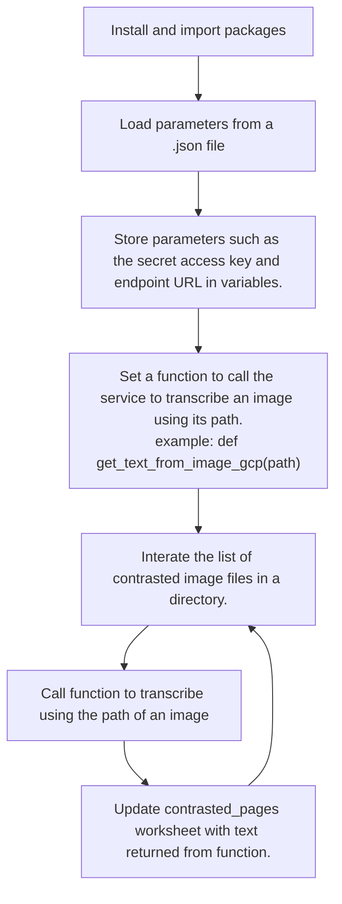

# fieldbooks_antioch

This program transcribes images of a handwritten fieldbook into text. It does it with three different services:

+ Microsoft Azure Cognititive Services
+ Amazon Web Services
+ Google Cloud Platform.

The results are stored in a [Google sheet](https://docs.google.com/spreadsheets/d/1RJIX6HDAOfD1GObbu1wJOo-gOlRG3uWwG0JM_iQWdA8/edit?usp=sharing). See the 'contrasted_pages' sheet.

## Objectives

### Primary

Transcribe the writing in the fieldbook with high quality results.

#### Secondary

+ Test techniques to improve the results of transcription, such as increasing contrast of images.
+ Compare the quality of transcription by three companies at this time.

There is a [blog post](https://jeffblackadar.ca/uncategorized/handwriting-transcription-of-a-fieldbook-with-microsofts-azure-cognitive-services-and-amazons-aws-textract/) about this process. 


## files

git.ipynb - git commands to commit and push work done on Google Colab

fieldbook_antioch_1_get_images.ipynb - Download, contrast and inspect images before transcription
fieldbook_antioch_extract_text.ipynb - Trancribe images

## folders

Images are stored in these folders:

### /content/drive/MyDrive/fieldbooks_images/all_images

The parent folder.

### /content/drive/MyDrive/fieldbooks_images/all_images/raw_images

Raw images downloaded from Ochre.

### /content/drive/MyDrive/fieldbooks_images/all_images/raw_split_pages

Some raw images are scans of an open book with two pages. These images are split into pages 1 and 2 and saved here.

### /content/drive/MyDrive/fieldbooks_images/all_images/contrasted_split_pages

To try to improve transcription results, images are converted into black and white. Sometimes this improves results, other times the results are worse. It depends on the darkness of the pencil lines.


## fieldbook_antioch_1_get_images.ipynb

The notebook uses Google Colab, Google Drive and Google Sheets.

There are 4 sections:

+ Google sheet - Get handle on it
+ Download raw images
+ Split images
+ Contrast images

The sections are described below.

### Google sheet - Get handle on it

Installs gspread, authenticates and opens the fieldbook_pages worksheet.

### Download raw images

This routine loops through each row of the spreadsheet. 

The image is downloaded from its URL in column D.

Example: https://pi.lib.uchicago.edu/1001/org/ochre/f5337e52-97e4-4251-8d85-22aca943d220&load

The image is saved with file name using column C.

Example: 1932-002-0000. "ANT_FB_" is prepended to match the convention used previously and the extension is .jpg

ANT_FB_1932-002-0000.jpg

### Split images

This routine loops through each row of the spreadsheet. Some raw images are scans of an open book with two pages. This routine splits a wide image into pages 1 and 2 and saves the files. The spreadsheet is updated with the file names of the pages in columns I and K.
Narrow images are left as 1 page.

There is a form to check each image. The pages are displayed to check the results of the split.

### Contrast images

This routine loops through each row of the spreadsheet. The process reads each .jpg file in the raw_split_pages folder. It saves a contrasted version in the contrasted_split_pages folder.

There is a form to check each image. The original page and contrasted image is displayed to check the results of the contrast. The contrast can be re-run for a row of pages and the threshold vlaue adjusted.

```mermaid
graph TD

D1["Get handle on spreadsheet"]-->D2["Download each image URL in column D."]
D2-->D3["Split wide images into 2 pages."]
D3-->D4["Inspect page split images"]
D4-->D5["Contrast images."]
D5-->D6["Inspect contrasted images."]
D6-->D7{"Contrast good?"}
D7-->|Yes|D5
D7-->|No|D8["Change threshold and re-run contrast for image."]
D8--D7
```

## fieldbook_antioch_extract_text.ipynb

The notebook uses Google Colab, Google Drive and Google Sheets.

There are five sections:

+ Google sheet - Get handle on it
+ Azure Cognitive Services
+ AWS
+ GCP
+ Write HTML files

The sections are described below.

### Google sheet - Get handle on it

Installs gspread, authenticates and opens the fieldbook_pages worksheet.

### Azure Cognitive Services, AWS, GCP

Each of the three services runs in the same manner.



### Write HTML files

This cell loops through the rows of the contrasted_pages worksheet and saves them into html pages.
